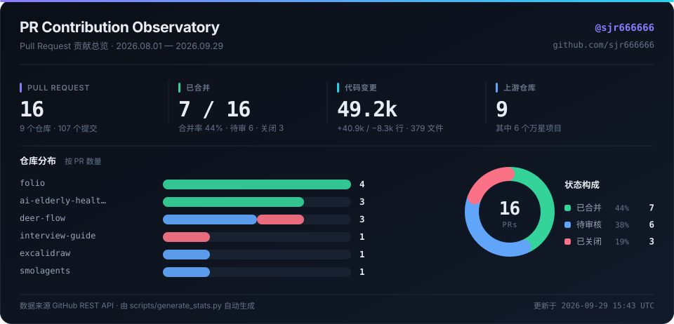
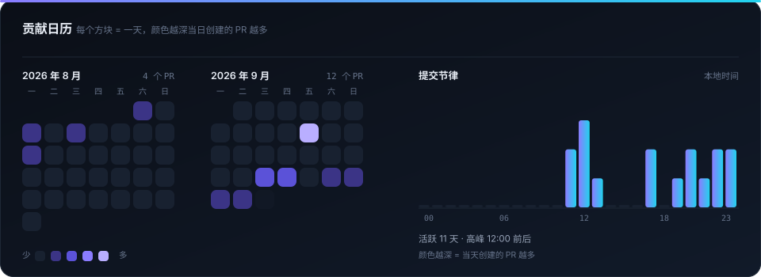
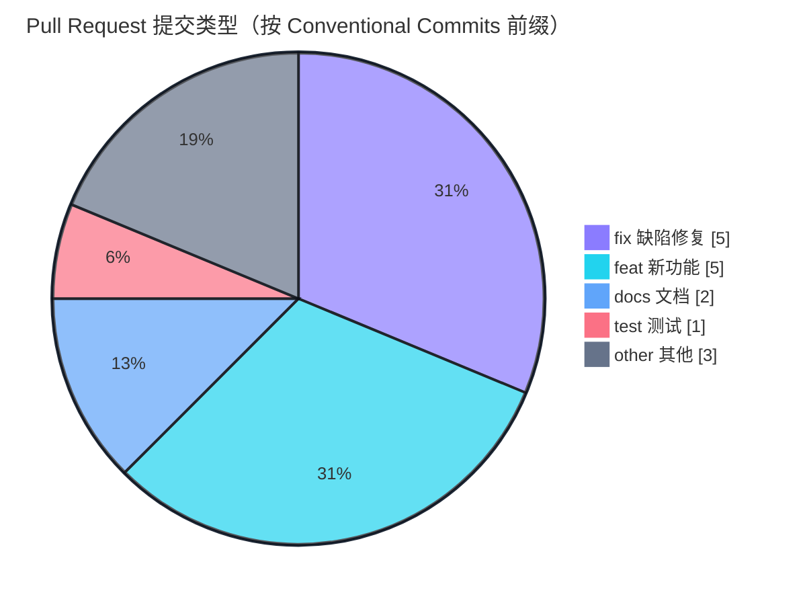
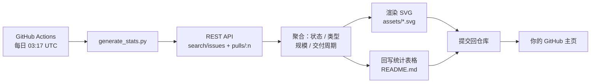

# 石敬荣 · sjr666666

**Agent 开发 · 后端 / 全栈** · 2028 届本科在读

喜欢往别人的代码库里提交小体积、带测试、能自证的 PR。

---

## 📡 PR Contribution Observatory

  

  

> 两张卡片由 [`scripts/generate_stats.py`](./scripts/generate_stats.py) 直连 GitHub REST API 生成，
> 经 [GitHub Actions](./.github/workflows/update-stats.yml) 每日自动刷新 —— 所见即当前数据，没有手工维护的数字。

---

## 🔬 贡献画像

<table>
<tr><td width="50%" valign="top">

**我最常做的事是「修边界」**

在 16 个 PR 里，`fix` 与 `feat` 各占 5 个。`fix` 集中在三类高频区：
参数校验的静默失败、并发读改写丢数据、跨平台（Windows / 容器）行为不一致。

</td><td width="50%" valign="top">

**小步提交，便于审查与回滚**

变更规模主要落在 S 档（20–100 行），多数 PR 只碰 2–3 个文件。
唯一的大体积提交是自有项目的工程化上线 PR。

</td></tr>
<tr><td valign="top">

**向上游提出，而不是只写自己的仓库**

16 个 PR 中有 13 个提给非本人仓库，覆盖 Agent 运行时、前端框架、
测试框架与企业级工具链，其中 6 个是万星以上项目。

</td><td valign="top">

**按仓库的贡献分布**

`helsome/folio` 4 · `ai-elderly-health-assistant` 3 · `bytedance/deer-flow` 3 ·
`huggingface/smolagents` / `vitest-dev/vitest` / `excalidraw` /
`modelcontextprotocol/typescript-sdk` / `freeCodeCamp` / `Snailclimb/interview-guide` 各 1

</td></tr>
</table>

---

## 🧩 提交类型分布

---

## 📋 全部 Pull Request

<!-- STATS:BEGIN -->
**16** 个 Pull Request · **7** 个已合并 · 覆盖 **9** 个仓库

| 仓库 | PR | 标题 | 变更 | 文件 | 耗时 | 状态 | 创建 |
|:--|--:|:--|--:|--:|--:|:--|--:|
| [bytedance/deer-flow](https://github.com/bytedance/deer-flow) | [#6049](https://github.com/bytedance/deer-flow/pull/6049) | docs: fix 404ing landing-page links with root-relative /docs/… | +28 −28 | 2 | — | 待审核 | 2026-09-29 |
| [bytedance/deer-flow](https://github.com/bytedance/deer-flow) | [#6005](https://github.com/bytedance/deer-flow/pull/6005) | docs: fix 404ing relative links on the docs landing page | +28 −28 | 2 | 2.1 时 | 已关闭 | 2026-09-28 |
| [bytedance/deer-flow](https://github.com/bytedance/deer-flow) | [#5974](https://github.com/bytedance/deer-flow/pull/5974) | fix(readability): keep resolved link destinations when Readab… | +338 −18 | 3 | — | 待审核 | 2026-09-27 |
| [huggingface/smolagents](https://github.com/huggingface/smolagents) | [#2855](https://github.com/huggingface/smolagents/pull/2855) | Fix CallbackRegistry TypeError for callbacks with flexible si… | +57 −4 | 2 | — | 待审核 | 2026-09-26 |
| [vitest-dev/vitest](https://github.com/vitest-dev/vitest) | [#11352](https://github.com/vitest-dev/vitest/pull/11352) | fix(browser): only rewrite Vue dependencies when Vue test uti… | +22 −2 | 2 | — | 待审核 | 2026-09-24 |
| [excalidraw/excalidraw](https://github.com/excalidraw/excalidraw) | [#12159](https://github.com/excalidraw/excalidraw/pull/12159) | fix(collab): broadcast canceled multi-point arrows as deleted | +64 −8 | 3 | — | 待审核 | 2026-09-24 |
| [freeCodeCamp/freeCodeCamp](https://github.com/freeCodeCamp/freeCodeCamp) | [#70326](https://github.com/freeCodeCamp/freeCodeCamp/pull/70326) | fix(curriculum): correct punctuation in HTML lecture intros | +4 −4 | 1 | 14 分 | 已关闭 | 2026-09-23 |
| [modelcontextprotocol/typescript-sdk](https://github.com/modelcontextprotocol/typescript-sdk) | [#2847](https://github.com/modelcontextprotocol/typescript-sdk/pull/2847) | test(node): handle SSE responses split across chunks | +43 −9 | 1 | — | 待审核 | 2026-09-23 |
| [helsome/folio](https://github.com/helsome/folio) | [#76](https://github.com/helsome/folio/pull/76) | feat(shared): persist stream event log for cross-restart repl… | +1,886 −23 | 27 | 6.7 天 | 已合并 | 2026-09-11 |
| [helsome/folio](https://github.com/helsome/folio) | [#43](https://github.com/helsome/folio/pull/43) | feat: wire Stream Event v1 transport and renderer log | +1,459 −23 | 24 | 7 天 | 已合并 | 2026-09-11 |
| [helsome/folio](https://github.com/helsome/folio) | [#42](https://github.com/helsome/folio/pull/42) | feat(shared): add parallel Stream Event v1 channel to RunMana… | +437 −0 | 7 | 7 天 | 已合并 | 2026-09-11 |
| [helsome/folio](https://github.com/helsome/folio) | [#41](https://github.com/helsome/folio/pull/41) | feat(core): add Stream Event Protocol v1 types (ADR 0001) | +233 −0 | 4 | 7 天 | 已合并 | 2026-09-11 |
| [Snailclimb/interview-guide](https://github.com/Snailclimb/interview-guide) | [#50](https://github.com/Snailclimb/interview-guide/pull/50) | feat: 新增 JD 匹配分析与简历版本迭代 | +3,205 −29 | 43 | 4.2 天 | 已关闭 | 2026-08-10 |
| [sjr666666/ai-elderly-health-assistant](https://github.com/sjr666666/ai-elderly-health-assistant) | [#3](https://github.com/sjr666666/ai-elderly-health-assistant/pull/3) | fix(auth): improve login and registration validation | +72 −71 | 10 | 2 分 | 已合并 | 2026-08-05 |
| [sjr666666/ai-elderly-health-assistant](https://github.com/sjr666666/ai-elderly-health-assistant) | [#2](https://github.com/sjr666666/ai-elderly-health-assistant/pull/2) | Codex/publish project | +32,520 −7,445 | 219 | 22 分 | 已合并 | 2026-08-03 |
| [sjr666666/ai-elderly-health-assistant](https://github.com/sjr666666/ai-elderly-health-assistant) | [#1](https://github.com/sjr666666/ai-elderly-health-assistant/pull/1) | [codex] harden and document medication manager | +507 −561 | 29 | 1.3 时 | 已合并 | 2026-08-01 |

最后更新 2026-09-29 15:34 UTC · 由 `scripts/generate_stats.py` 自动生成
<!-- STATS:END -->

---

## 🚀 主要开源项目

### AI 药管家 · 智能老人用药管理系统

专为老年人设计的智能用药安全与健康管理应用 —— 用药冲突检测 · AI 健康咨询 · 服药提醒 · 家属远程监护。

<table>
<tr><td valign="top" width="33%">

**技术栈**

`Java 21` `Spring Boot` `MyBatis-Plus`
`React` `MySQL` `Redis` `Docker`

</td><td valign="top" width="33%">

**工程化**

Flyway 迁移管理 · JWT 鉴权
Docker Compose 一键部署
GitHub Actions CI

</td><td valign="top" width="33%">

**AI 能力**

RAG 用药知识库 · OCR 处方识别
DeepSeek 生成链路

</td></tr>
</table>

> 仓库内的 PR 记录了我如何把这个项目从「能跑」推进到「可交付」：
> [发布工程化改造](https://github.com/sjr666666/ai-elderly-health-assistant/pull/2) ·
> [登录注册校验加固](https://github.com/sjr666666/ai-elderly-health-assistant/pull/3) ·
> [药品管理模块加固与补文档](https://github.com/sjr666666/ai-elderly-health-assistant/pull/1)

其余公开仓库见 <a href="https://github.com/sjr666666?tab=repositories">Repositories</a>。

---

## 🛠 技术栈

---

## 🔁 这份可视化是怎么来的

零第三方依赖：只用 Python 标准库 + GitHub 官方 API，卡片渲染全部手写 SVG，
所以没有外部图床挂掉导致主页开天窗的风险。

---

📫 交流与合作：欢迎通过 <a href="https://github.com/sjr666666">GitHub Issues</a> 或邮件联系。

