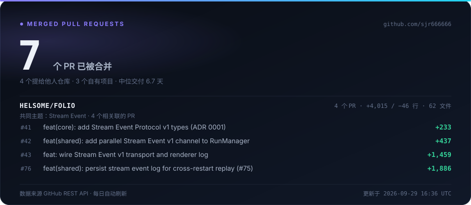

# 石敬荣

**Agent 开发 · 后端 / 全栈** · 2028 届本科在读

---

## 已合并的 Pull Request

<!-- STATS:BEGIN -->
**7** 个 PR 已被合并

- **4** 个提给他人仓库（[`helsome/folio`](https://github.com/helsome/folio)）· 合计 **+4,015 / −46** 行 · 62 个文件
- **3** 个自有项目（`ai-elderly-health-assistant`）的发布与加固 PR

| 仓库 | PR | 标题 | 变更 | 文件 | 交付周期 | 合并日期 |
|:--|--:|:--|--:|--:|--:|--:|
| [`folio`](https://github.com/helsome/folio) | [#41](https://github.com/helsome/folio/pull/41) | feat(core): add Stream Event Protocol v1 types (ADR 0001) | `+233` `−0` | 4 | 7 天 | 2026-09-18 |
| [`folio`](https://github.com/helsome/folio) | [#42](https://github.com/helsome/folio/pull/42) | feat(shared): add parallel Stream Event v1 channel to RunManager | `+437` `−0` | 7 | 7 天 | 2026-09-18 |
| [`folio`](https://github.com/helsome/folio) | [#43](https://github.com/helsome/folio/pull/43) | feat: wire Stream Event v1 transport and renderer log | `+1,459` `−23` | 24 | 7 天 | 2026-09-18 |
| [`folio`](https://github.com/helsome/folio) | [#76](https://github.com/helsome/folio/pull/76) | feat(shared): persist stream event log for cross-restart replay | `+1,886` `−23` | 27 | 6.7 天 | 2026-09-18 |
| [`ai-elderly-health-assistant`](https://github.com/sjr666666/ai-elderly-health-assistant) | [#3](https://github.com/sjr666666/ai-elderly-health-assistant/pull/3) | fix(auth): improve login and registration validation | `+72` `−71` | 10 | 2 分钟 | 2026-08-05 |
| [`ai-elderly-health-assistant`](https://github.com/sjr666666/ai-elderly-health-assistant) | [#2](https://github.com/sjr666666/ai-elderly-health-assistant/pull/2) | Codex/publish project | `+32,520` `−7,445` | 219 | 22 分钟 | 2026-08-03 |
| [`ai-elderly-health-assistant`](https://github.com/sjr666666/ai-elderly-health-assistant) | [#1](https://github.com/sjr666666/ai-elderly-health-assistant/pull/1) | [codex] harden and document medication manager | `+507` `−561` | 29 | 1.3 小时 | 2026-08-01 |

由 [`scripts/generate_stats.py`](./scripts/generate_stats.py) 直连 GitHub REST API 生成，经 GitHub Actions 每日自动刷新 · 最后更新 2026-09-29 16:33 UTC
<!-- STATS:END -->

---

## 代表项目 · AI 药管家

专为老年人设计的智能用药安全与健康管理应用 —— 用药冲突检测 · AI 健康咨询 · 服药提醒 · 家属远程监护。

`Java 21` `Spring Boot` `MyBatis-Plus` `React` `MySQL` `Redis` `Docker` · Flyway 迁移管理 · GitHub Actions CI

工程化交付的三个 PR：[发布上线改造](https://github.com/sjr666666/ai-elderly-health-assistant/pull/2) · [登录注册校验加固](https://github.com/sjr666666/ai-elderly-health-assistant/pull/3) · [药品管理模块加固与补文档](https://github.com/sjr666666/ai-elderly-health-assistant/pull/1)

---

## 技术栈

---

本页所有数字由 <a href="./scripts/generate_stats.py">scripts/generate_stats.py</a> 直连 GitHub REST API 生成， 经 GitHub Actions 每日自动刷新 —— 没有手工维护的数字。

