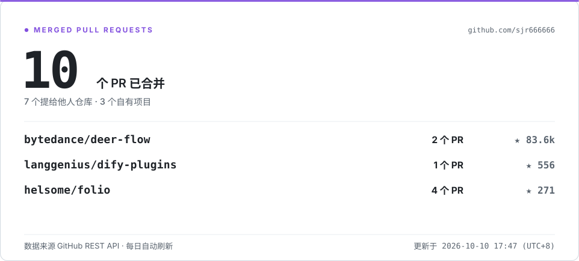

<picture>
  <source media="(prefers-color-scheme: dark)" srcset="https://raw.githubusercontent.com/sjr666666/sjr666666/output/github-contribution-grid-snake-dark.svg">
  
</picture>

# 石敬荣 · sjr666666

**Agent 开发 · 后端 / 全栈** · 2028 届本科在读

<picture>
  <source media="(prefers-color-scheme: dark)" srcset="./assets/merged-prs-dark.svg">
  
</picture>

<!-- STATS:BEGIN -->
**8** 个 PR 已被合并 · 数据由 [`generate_stats.py`](./scripts/generate_stats.py) 每日直连 GitHub API 刷新
<!-- STATS:END -->

---

## 代表项目

**TinyCode** —— 一个「能在一个下午读完」的完整 Coding Agent Harness：模型接入 · Agent 循环 · 工具 · 权限 · 会话 · 上下文工程 · Skills · MCP · 子代理 · TUI，十个子系统一个不少。

[仓库](https://github.com/sjr666666/tinycode) · MIT · TypeScript · `47 个源文件 / 15 个测试文件` · `约 6.6k 行` · 基于 Pi Agent Runtime · 附 27 篇源码拆解文档

**AI 药管家** —— 面向老年人的智能用药安全与健康管理应用：用药冲突检测 · AI 健康咨询 · 服药提醒 · 家属远程监护。

[仓库](https://github.com/sjr666666/ai-elderly-health-assistant) · MIT · ★ 7 · `Java 21` `Spring Boot` `MyBatis-Plus` `React` `MySQL` `Redis` `Docker`

工程化交付：[发布上线改造](https://github.com/sjr666666/ai-elderly-health-assistant/pull/2) · [登录注册校验加固](https://github.com/sjr666666/ai-elderly-health-assistant/pull/3) · [药品管理模块加固与补文档](https://github.com/sjr666666/ai-elderly-health-assistant/pull/1)
